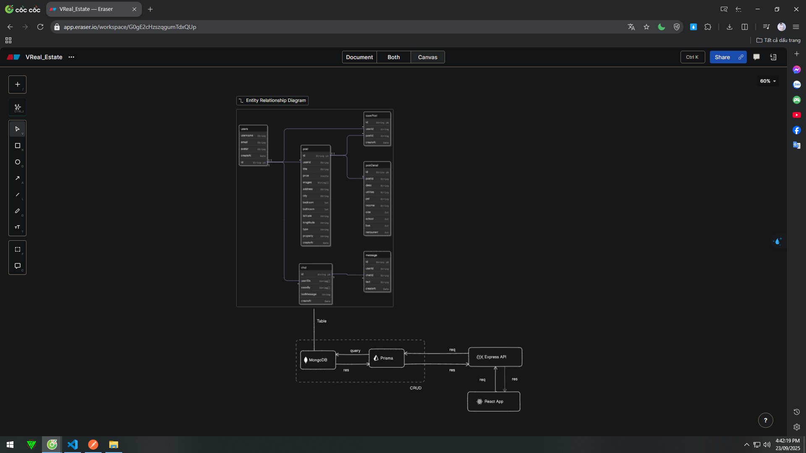

## Website Real Estate || MERN Stack App & Real-time Chat

- <b>@author:</b> <i>Vinhdev04</i>

---

### Technical:

- ReactJs
- NodeJs
- MERN Stack
- Nodemon,morgan
- Prisma

---

### Skill

- Test API with Postman
- Bcript to hash password
- DATABASE_URL="mongodb+srv://vinhdev04:<db_password>@cluster0.ggovags.mongodb.net/?retryWrites=true&w=majority&appName=Cluster0"



-

```
        users{
        id String pk
        username String
        email String
        avatar String
        createAt Date
        }

        post{
        id String pk
        userId String
        title String
        price invite
        images String[]
        address String
        city String
        bedroom Int
        bathroom Int
        latitude String
        longtitude String
        type String
        property String
        createAt Date
        }

        postDetail{
        id String pk
        postId String
        desc String
        utilities String
        pet String
        income String
        size Int
        school Int
        bus Int
        restaurent Int
        }

        savePost{
        id String pk
        userId String
        postId String
        createAt Date
        }

        chat {
        id String pk
        userIDs String[]
        seenBy String[]
        lastMessage String
        createAt Date
        }

        message {
        id String pk
        userId String
        chatId String
        text String
        createAt Date
        }

        // 1 user - many post
        users.id < post.userId

        // 1 post - 1 post detail
        post.id - postDetail.postId

        // 1 user - save post
        users.id < savePost.userId

        // 1 post - many savr post
        post.id < savePost.postId

        // 1 user - many chat,message
        users.id < chat.userIDs
        chat.id < message.chatId

```
